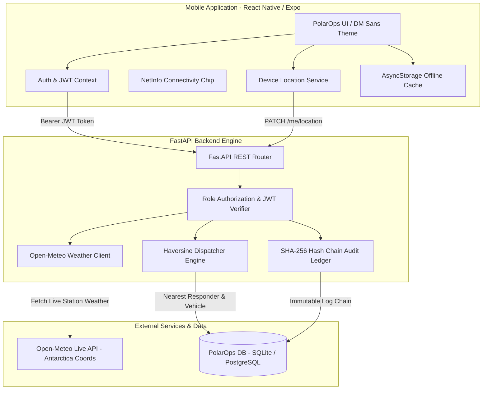

# PolarOps Architecture & System Design (SIH26062)

## High-Level System Architecture

## Data Flow & Security Model

1. **Authentication**: Users authenticate via `POST /auth/login` (or self-register as `Team Member` via `POST /auth/register`). Tokens are signed using HS256 JWT algorithm.
2. **Role Enforcement**:
   - `Expedition Leader`: Full administrative privileges, user account provisioning (`POST /users`), role reassignment (`PATCH /users/{id}/role`), expedition creation (`POST /expeditions`).
   - `Team Member`: Read access, emergency SOS triggering (`POST /sos`), real-time location sync (`PATCH /me/location`).
3. **Emergency SOS Dispatch**:
   - Filters responders based on skill (`doctor`, `mechanic`, `pilot`, `engineer`).
   - Applies strict **10-minute location freshness filter** (`last_location_update >= now - 10m`).
   - Calculates distance using **Haversine formula**.
   - Dispatches nearest responder + nearest available vehicle (`Sno-Cat`, `Helicopter`).
   - Writes immutable SHA-256 audit entry to ledger (`GET /audit/verify`).
4. **Live Antarctic Weather**: Fetches real-time sub-zero metrics directly from Open-Meteo API for Maitri (`-70.766, 11.733`) and Bharati (`-69.407, 76.191`).
